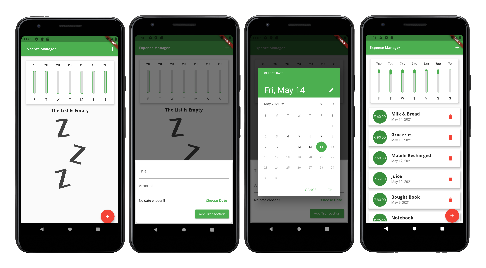

# Expense Manager

This is a **Expense manager** App made with **Flutter**. This app is very useful when u consider money management. it has an interesting chart interface to show the money spent on last 7 days. user can add <em>transaction</em>, mention **date** and description of transaction for future reference. 

## FeatureS

|  UI  | Feature |
| ------| ------|
| ✔ | Can save transaction records
| ✔ |   bar charts to see weekly mone spent
| ✔ |    date feature
| ✔ |    helps in easy analysis of money flow.

## To play the game download the **APK** above!

## Screenshots

